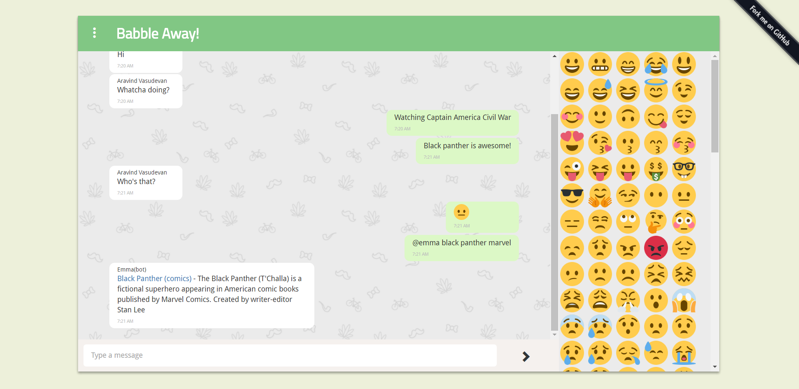
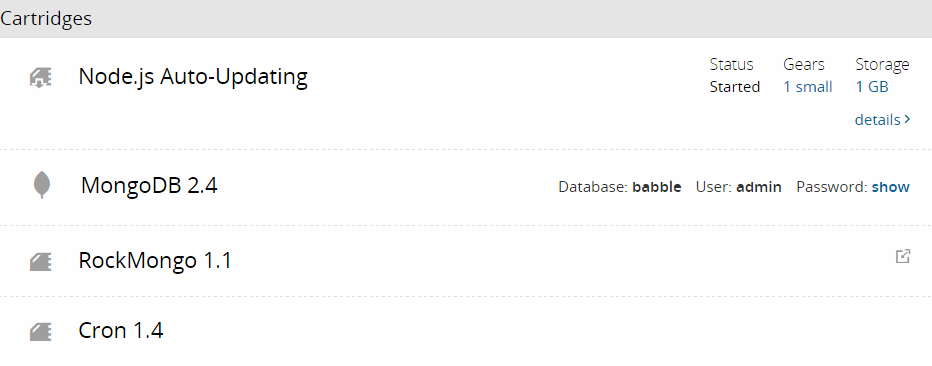

# Babble.gq
[](https://www.versioneye.com/user/projects/5830b93d182815003cfd93e7)
> A Real Time Chat Application built using Node.js, Express, Handlebars, Mongoose, Socket.io, Passport, & express-mvc-h5bp.

## Index
  * [Demo](#demo)
  * [Features](#features)
  * [Installation](#installation)
  * [Deploying in Openshift v2](#deploy)
  * [Contribute](#contribute)
  * [License](#license)

## Demo <a name="demo"></a>
Check it out: [babble.gq](http://babble.gq/)

## Features<a name="features"></a>
  * Responsive Interface
  * Web Sockets for Communication using Socket.io
  * Secure OAuth Authetication with Facebook using Passport
  * Emoji Column for easy inclusive of emojis (right click triggers larger emoji)
  * Image Upload Functionality
  * Log for user entry & exit

## Installation <a name="installation"></a>
  1. Clone or Download the repository

    ```
    $ git clone https://github.com/AravindVasudev/Babble.gq.git
    $ cd Babble.gq
    ```
  2. Install Dependencies

    ```
    $ npm install
    ```
  3. Add Facebook Client ID, Client Secret and Callback URL of your app to config/auth.js

  4. Download and Install MongoDB

  5. Run Mongo DB Server

  ```
  $ mongod
  ```
  6. Start the Application

  ```
  $ npm start
  ```
  Your app should now be running on localhost:3000.

  `The Application can be deployed now in Openshift v2 without any changes`

## Deploying in Openshift v2 <a name="deploy"></a>
  1. Create an Application with the following catridges

    

  2. Clone your application repository and cd into it

  3. Empty the application folder

  4. Clone or Download this repository into that folder

  5. Add Facebook Client ID, Client Secret and Callback URL of your app to config/auth.js

  6. Commit the changes

## Contribute <a name="contribute"></a>
  You are always welcome to open an issue or provide a pull-request!

## License <a name="license"></a>
Built under [MIT](http://www.opensource.org/licenses/mit-license.php) license.
